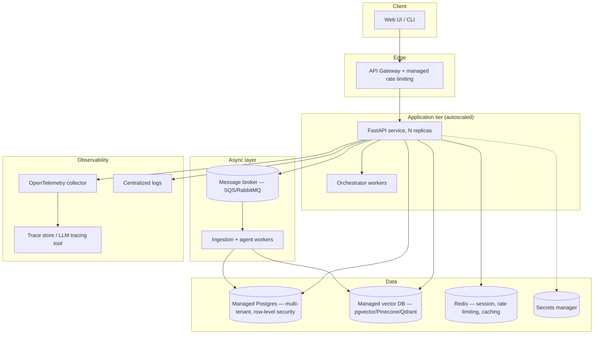
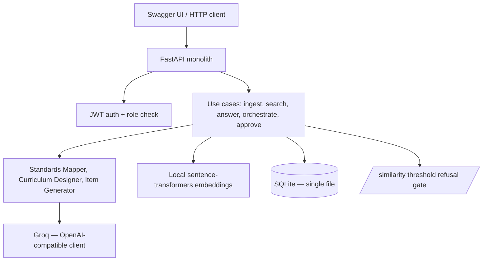

# System Design — Domain Copilot (TeachPilot)

**Variant:** D3 (Education — Curriculum & Assessment Design) + T0 (Multi-tenancy)

This document has two parts, as required by the brief: **Part A** describes
the target architecture with no time/budget constraint. **Part B** describes
what was actually built in the ~40-hour window, with a gap table explaining
every deferral.

---

## Part A — Target architecture (unconstrained)

If this were a funded production system serving multiple institutions at
scale, the architecture would look like this:

**Key target-state components and why:**

- **Managed API gateway + rate limiting** — per-tenant and per-user quotas
  enforced at the edge, not in application code, so a single noisy tenant
  can't starve others.
- **Managed secrets manager** (AWS Secrets Manager / Vault) — API keys and
  the JWT signing key rotate automatically and are never read from `.env`
  in production.
- **Message broker + worker pool** — ingestion and agent-workflow runs are
  long-running and should never block an HTTP request thread; a real
  queue (not in-process `BackgroundTasks`) gives retry, dead-lettering,
  and horizontal scaling.
- **Managed vector database** (pgvector on managed Postgres, or a
  dedicated vector DB) — replaces the current SQLite-with-JSON-blob
  embedding storage, giving real ANN indexing instead of a linear scan.
- **Autoscaling application tier** — stateless FastAPI replicas behind a
  load balancer, scaled on request volume.
- **Full observability stack** — OpenTelemetry traces spanning
  request → orchestrator → agent → LLM call, exported to a real trace
  store (e.g. Langfuse, self-hosted Jaeger, or a vendor APM), plus
  centralized structured logs and dashboards.
- **CI/CD across environments** — staging + production, blue/green or
  canary deploys, automated rollback on health-check failure.
- **DR/backup** — automated Postgres snapshots, point-in-time recovery,
  a documented RTO/RPO.
- **Cost model at scale** — per-tenant token budgets enforced at the
  gateway, a cached-embeddings layer to avoid re-embedding on re-ingest,
  and a cost dashboard broken down by tenant and by agent.

---

## Part B — Implemented MVP

### B.1 What was actually built

A single FastAPI process, SQLite as the only datastore (tables:
`tenants`, `users`, `documents`, `document_chunks`, `agent_runs`,
`assessment_items`), Groq as the sole LLM provider, and local
`sentence-transformers` embeddings (no external embedding API needed).
Ingestion runs synchronously within the request (`BackgroundTasks`, not a
real queue). No containerization yet — run directly via `uvicorn` in a
conda/venv environment.

### B.2 Gap table

| Target component | Implemented? | Why deferred | Interim mitigation | Effort + cost to close |
|---|---|---|---|---|
| Managed vector DB (pgvector/Pinecone) | No — SQLite + JSON-blob embeddings, linear cosine scan | 30-doc corpus is small enough that a linear scan is fast (<50ms); a managed vector DB needs infra I don't have budget for in 40h | Hybrid dense+keyword search over the linear scan, with RRF fusion — correct results, just O(n) not O(log n) | ~4h + managed Postgres/pgvector free tier (or ~$15–25/mo hosted) |
| Message broker + async workers (T7-style) | No — ingestion runs in FastAPI `BackgroundTasks` | T7 (async jobs) isn't my assigned twist (T0 is); a real queue is a full sub-project on its own | Ingestion is fast enough per-document (<2s) that in-process background tasks don't block the API meaningfully at this corpus size | ~6–8h to wire Redis/RQ or Celery + a worker process |
| Second, working LLM provider (local/offline fallback) | No — only Groq is wired up | Provider *abstraction* exists (`infrastructure/llm_service.py` is the only place that imports the LLM SDK — domain/application never do), but a second concrete implementation wasn't built in the time available | If Groq's free-tier rate limit is hit, requests fail with a clear `429`/`500` rather than silently hanging or guessing | ~3h to add an Ollama-backed implementation of the same interface, selected by `.env` config |
| Managed secrets manager | No — `.env` file, gitignored | Out of scope for a local/free-tier assessment; no cloud account budgeted | Secret scan run over full git history before submission; `.env.example` has placeholders only | ~2h to wire AWS Secrets Manager or Vault if deploying to real cloud infra |
| OpenTelemetry tracing / dedicated trace store | Partial — every agent step is persisted with timestamps, agent name, and status in `agent_runs.steps_json`, inspectable by run ID via `GET /workflow/runs/{id}` | A full OTEl collector + Jaeger/Langfuse stack is infra-heavy for the time budget; the brief accepts "a clean custom trace store" as equally valid | Custom trace store (the `agent_runs` table) satisfies FR-9's "any agent run can be inspected afterwards" requirement without the extra infra | ~5h to add OTel spans on top of the existing structured run log |
| Docker packaging (`docker compose up`) | No | Deferred in favor of finishing the evaluation harness and agent pipeline first — see priority order in the brief §8 | `scripts/setup.sh` / `setup.ps1` give an equivalent one-command local setup (conda/venv + seed), just not containerized | ~3h — SQLite makes this simpler than most stacks (no separate DB container needed) |
| Autoscaling / load balancing | No | Single-tenant-scale local deployment; not meaningful to build without real cloud infra | N/A at this scale | Infra-dependent; not a code change |
| OCR for scanned/image-only documents (T6 territory) | No | T6 (Document in/out) is not my assigned twist (T0 is) — 3 ingested PDFs in the corpus are image-only slides with no text layer | The ingestion pipeline detects this and reports `status: "no_extractable_text"` per document (see FR-1's failure-reporting requirement) rather than silently claiming success | ~4–6h to add an OCR fallback (e.g. `pytesseract`) for pages with empty extracted text |

### B.3 Where an expedient or poor choice was made under time pressure

- **`SIMILARITY_THRESHOLD` was originally compared against the RRF fusion
  score, not raw cosine similarity** — a real bug caught mid-build (see
  `docs/AI-USAGE-LOG.md`). Fixed by separating "should we refuse"
  (raw dense-retrieval score) from "how do we rank what we show"
  (RRF fusion of dense + keyword). Documented here rather than hidden
  because it directly touches principle #1 (grounded, never guessing).
- **The evaluation golden set's `acceptable_sources` were authored by
  assumption** (which lecture number "should" cover which topic) rather
  than verified against the actual ingested corpus, which produced a
  misleading `retrieval_hit_rate: 0%` on a first run despite the system's
  answers being correct and well-cited. Fixed with
  `evaluation/fix_golden_set_sources.py`, which regenerates
  `acceptable_sources` from the real sources behind every answer already
  verified as `grounded: true`, and flags the rest for manual review
  rather than guessing. Baseline before/after and the full failure
  analysis are in `docs/EVALUATION.md`.
- **SQLite instead of Postgres** — the acceptance test in the brief
  ("swapping the vector store must require configuration plus one
  adapter") is satisfied structurally (repositories are the only place
  that touch SQL), but this hasn't been exercised against a second real
  database in the time available. Documented as a real gap, not claimed
  as done.

---

## Design decisions (with alternatives considered)

| Decision | Alternatives considered | Why this one |
|---|---|---|
| **Clean Architecture** (`domain/` → `application/` → `infrastructure/`/`api/`) | Simple MVC-style FastAPI app | The brief's acceptance test — swap LLM/vector-store provider via config, not business-logic changes — needs `domain/`/`application/` to never import an SDK. A flatter structure would fail that test immediately. |
| **Hybrid retrieval (dense + keyword) fused with RRF** | Dense-only retrieval | Dense-only misses exact-term matches (acronyms, numbers, named entities common in lecture slides); RRF fusion is simple, parameter-light, and doesn't require score normalization across two different scales. |
| **Supervisor-pattern orchestrator (Standards Mapper → Curriculum Designer → Item Generator, sequential)** | A planner-executor pattern where an LLM decides the next step dynamically | The D3 workflow (map standards → design curriculum → draft items) is a fixed, well-understood pipeline — a dynamic planner adds LLM-decision risk and cost with no real benefit here, and makes the max-iteration/timeout guards harder to reason about. |
| **SQLite** | Postgres from day one | Zero external infra to run the free-tier assessment locally; the repository-layer abstraction is what makes swapping to Postgres later a config + adapter change, not a rewrite (per the brief's own guidance to design for a free tier running out). |
| **Local `sentence-transformers` embeddings** | An embedding API (OpenAI/Groq) | Removes one more paid dependency entirely — ingestion works with zero API keys — and avoids embedding-cost concerns at 30+ documents. |
| **T0 (multi-tenancy) implemented via a `tenant_id` column + application-level filtering on every query**, rather than separate databases per tenant | Database-per-tenant; row-level security at the Postgres level | Database-per-tenant doesn't scale operationally for many small institutions; Postgres RLS wasn't available since the datastore is SQLite. `tenant_id` filtering enforced at the repository layer, tested explicitly in `tests/test_multitenancy.py`, was the pragmatic middle ground — documented as a target-state gap (Part A) to move to RLS on Postgres. |

See `docs/ARCHITECTURE.md` for the accompanying C4 diagrams, sequence
diagram of the full agentic workflow (including the approval gate and
streaming), and the ER diagram for the schema summarized in §B.1 above.