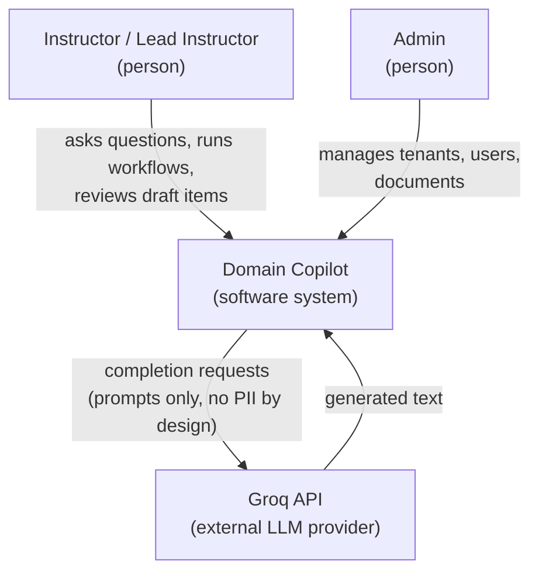
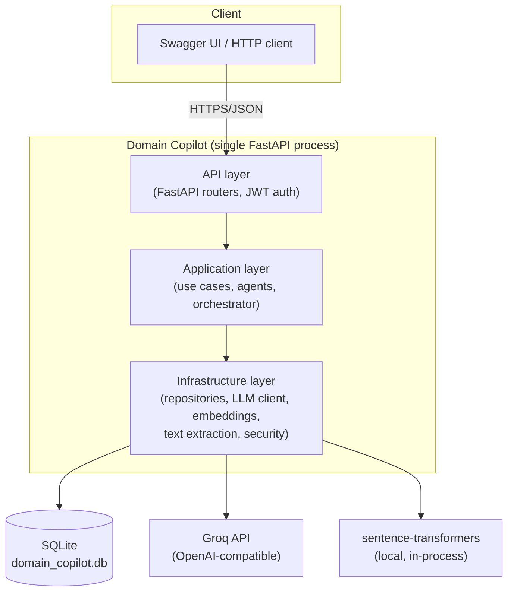
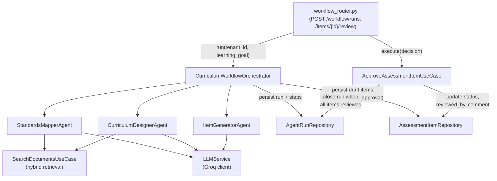
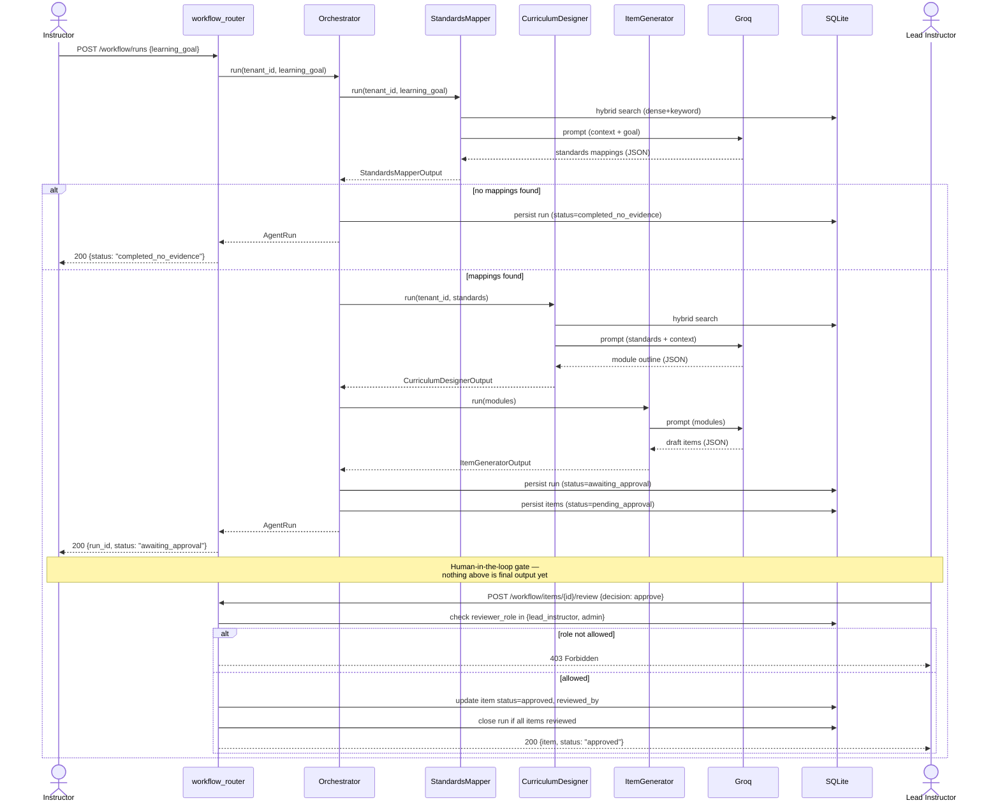
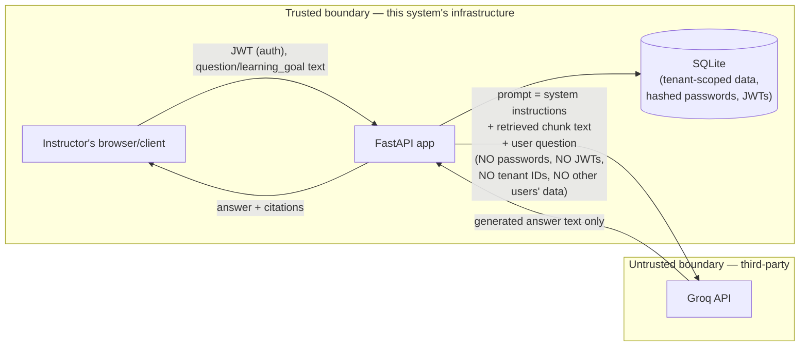
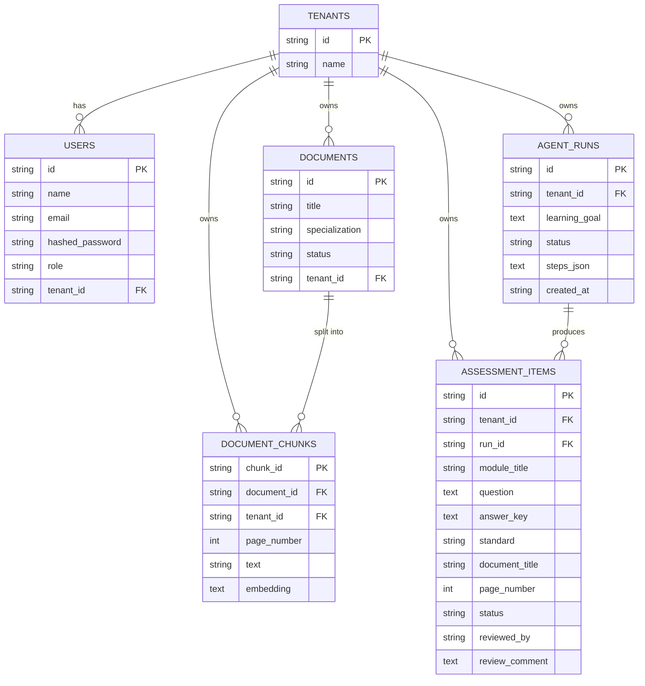
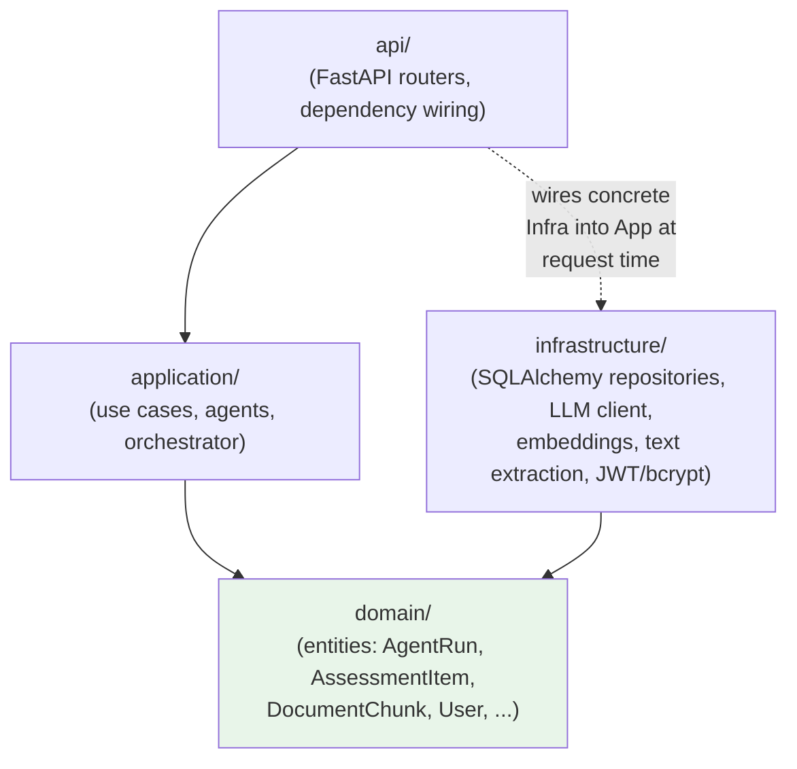

# Architecture — Domain Copilot (TeachPilot)

Diagram source lives in this file as Mermaid (GitHub renders it natively).
See `docs/SYSTEM-DESIGN.md` for the target-vs-implemented gap analysis this
architecture is built around.

---

## 1. C4 — Level 1: System Context

---

## 2. C4 — Level 2: Containers

---

## 3. C4 — Level 3: Components (agentic workflow slice)

---

## 4. Sequence diagram — full agentic workflow, including the approval gate

**Honest note:** this diagram does not show token-level streaming because
`/chat` and `/workflow/runs` currently return a single JSON response, not
SSE/WebSocket — FR-6 (real-time streaming) is a known gap, tracked in
`docs/SYSTEM-DESIGN.md`'s gap table rather than shown here as if built.

---

## 5. Data-flow diagram — trust boundaries and what the LLM provider sees

**What crosses the trust boundary to Groq:** the user's question/learning
goal, and the text of retrieved document chunks (already scoped to the
requesting tenant). **What never crosses it:** passwords, JWTs, `tenant_id`
values, other tenants' data, or any database identifiers beyond what's
needed for citations (document title, page number).

**Known gap:** retrieved chunk text is not sanitized before crossing this
boundary — see `docs/SECURITY.md` §2, indirect prompt injection.

---

## 6. ER diagram

---

## 7. Layer-dependency diagram (Clean Architecture)

**The acceptance test this enforces:** `domain/` and `application/` never
`import` an LLM SDK, a vector-store SDK, or FastAPI. The only file that
imports the `openai` client (pointed at Groq) is
`infrastructure/llm_service.py`; the only files that import `sqlalchemy`
are `infrastructure/models.py` and the `infrastructure/*_repository.py`
files. Swapping either is a change confined to `infrastructure/` plus
config — verified by inspection, not yet by an automated architecture
test (a `grep`-based CI check for this is a cheap addition, tracked as a
follow-up).

---

## 8. Architecture Decision Records (ADRs)

### ADR-1: Chunking and retrieval strategy

**Decision:** Fixed-size character chunking (1000 chars/chunk, no
overlap) per page, combined with **hybrid retrieval** — dense
(cosine similarity over local `sentence-transformers` embeddings) fused
with keyword (term-frequency) search via **Reciprocal Rank Fusion (RRF)**,
`k=60` (`application/hybrid_search.py`).

**Alternatives considered:** Semantic/sentence-boundary chunking (more
setup complexity for marginal gain at this corpus size); dense-only
retrieval (misses exact-term matches — acronyms like "OFDM", "ISM",
model numbers — that are common in these lecture slides).

**Consequence:** RRF fusion scores are **not** on the same scale as raw
cosine similarity — conflating them was an actual bug caught mid-build
(`docs/SYSTEM-DESIGN.md` §B.3, `docs/AI-USAGE-LOG.md`). The refusal
threshold now compares against the raw dense-retrieval score, and RRF is
used only for result ranking.

### ADR-2: Orchestration pattern

**Decision:** A **fixed sequential supervisor** (Standards Mapper →
Curriculum Designer → Item Generator), not a dynamic planner-executor.

**Alternatives considered:** An LLM-driven planner that decides the next
agent at each step.

**Why this one:** the D3 workflow (map standards → design curriculum →
draft items) is a well-understood, fixed pipeline. A dynamic planner adds
LLM decision risk and cost with no benefit here, and makes the
max-iteration/timeout guards (`application/agents/orchestrator.py`,
`MAX_RETRIES_PER_STEP`, `STEP_TIMEOUT_SECONDS`) simpler to reason about
and test (`tests/test_orchestrator.py`).

### ADR-3: Vector store choice

**Decision:** SQLite, storing each chunk's embedding as a JSON blob in a
`Text` column, with cosine similarity computed in Python over a linear
scan (`infrastructure/document_chunk_repository.py`).

**Alternatives considered:** A managed vector DB (pgvector, Pinecone,
Qdrant).

**Why this one:** at 30–40 documents (~1,500 chunks), a linear scan
completes in tens of milliseconds — a dedicated ANN index would add
infrastructure cost with no measurable benefit at this scale, and the
brief explicitly asks candidates to design for a free tier running out.
The repository-layer abstraction (nothing outside
`infrastructure/document_chunk_repository.py` touches embeddings
directly) is what makes migrating to pgvector later a config + adapter
change — documented as a target-state item in `docs/SYSTEM-DESIGN.md`
Part A, not yet exercised against a second real vector store.

### ADR-4: T0 (multi-tenancy) — isolation strategy

**Decision:** A single shared SQLite database with a `tenant_id` column
on every tenant-scoped table, enforced by filtering in the repository
layer on every query — never trusted from client input, always taken
from the authenticated JWT (`api/dependencies.py::get_current_user`).

**Alternatives considered:** A separate SQLite file per tenant (simpler
isolation guarantee, but doesn't scale operationally to many small
institutions and complicates cross-tenant admin tooling); Postgres
row-level security (the strongest option, but SQLite doesn't support
RLS).

**Why this one, and how isolation is actually verified:** application-
layer filtering is the pragmatic middle ground for this database choice.
Because "we filter correctly everywhere" is a claim that's easy to get
wrong silently, it's backed by `tests/test_multitenancy.py`, which
creates two tenants and asserts one can never read the other's documents,
runs, or items — not just that the filtering code exists, but that it
actually holds. Moving to Postgres RLS as a defense-in-depth layer is
documented as a target-state gap in `docs/SYSTEM-DESIGN.md` Part A.